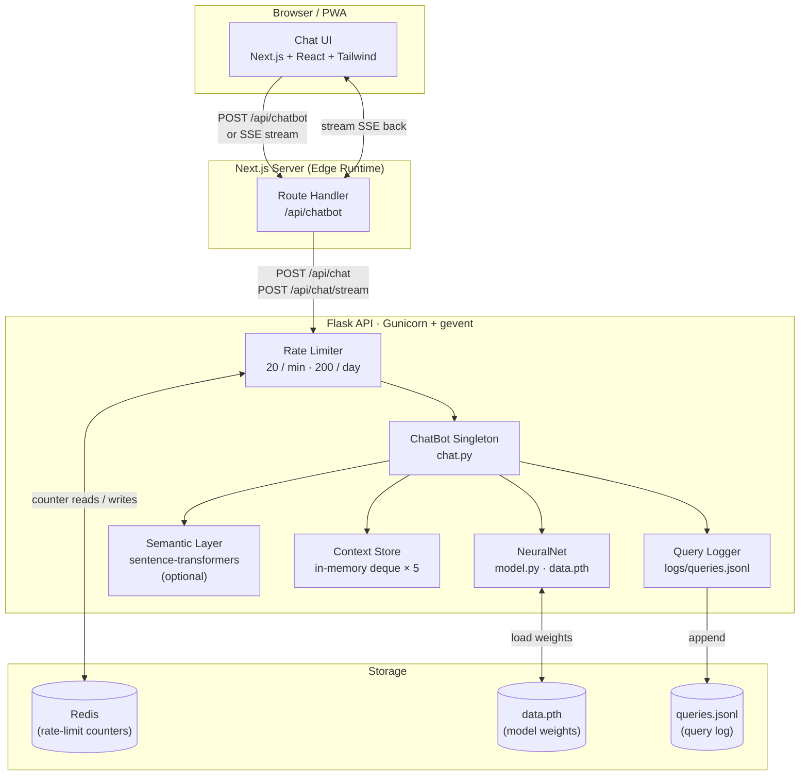
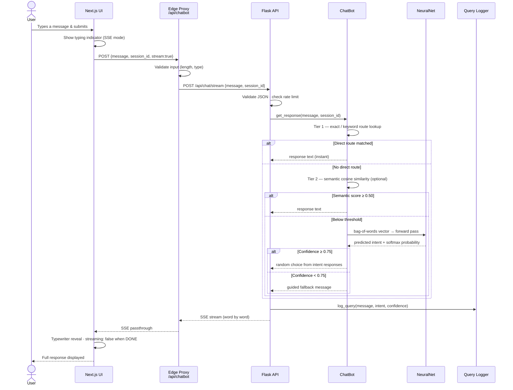
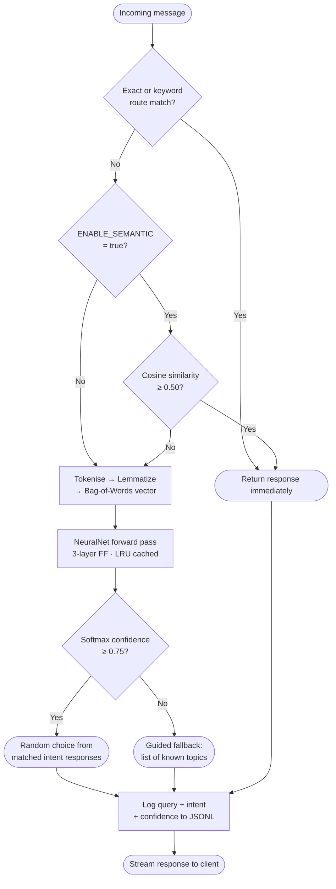
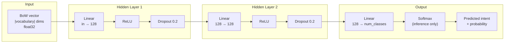

<div align="center">
  
  <h1>RCCIIT Student Chatbot</h1>
  <p>AI-powered student assistant for RCC Institute of Information Technology</p>

  
  
  
  
  
  
</div>

---

<p align="center">
  
</p>

---

## Overview

The RCCIIT Student Chatbot is a full-stack, intent-based conversational assistant for students of RCC Institute of Information Technology. It answers questions about admissions, courses, faculty, exam schedules, campus services, and more — responding in a first-person, college-representative voice and linking to official sources where relevant.

The bot runs a **three-tier inference pipeline**: deterministic keyword routing → optional semantic similarity layer → a PyTorch neural network classifier — so common queries are answered instantly while novel phrasings still get correct responses.

---

## Features

| Category | Detail |
|---|---|
| **NLP** | Intent classification via a 3-layer feed-forward neural network trained on 91 intents |
| **Inference pipeline** | Exact/keyword routes → semantic similarity (optional) → BoW + NN (confidence ≥ 0.75) → guided fallback |
| **Streaming** | Server-Sent Events (SSE) endpoint for word-by-word streaming; frontend reveals text with a typewriter animation |
| **Session context** | Per-session conversation history (in-memory deque, last 5 turns) |
| **Voice input** | Microphone button using the browser's Web Speech API |
| **Quick prompts** | Scrollable chip row for one-tap common queries |
| **Feedback** | Thumbs-up / thumbs-down rating on each bot message, logged server-side |
| **PWA** | Installable Progressive Web App with `manifest.json` and theme colour |
| **Rate limiting** | 20 req/min, 200 req/day per IP (Redis-backed or in-memory) |
| **Security** | Security headers, CORS allowlist, 2 000-char message cap, 1 MB body limit |

---

## System Architecture



---

## End-to-End Data Flow



---

## Inference Pipeline



---

## Neural Network Architecture



| Parameter | Value |
|---|---|
| Input size | Vocabulary size (derived from `intents.json`) |
| Hidden size | 128 |
| Output size | 91 intent classes |
| Activation | ReLU |
| Regularisation | Dropout (p = 0.2) |
| Optimizer | Adam, lr = 0.001 |
| Loss | CrossEntropyLoss |
| Epochs | 3 000 · Batch size 32 |

---

## Tech Stack

| | Technology | Version |
|---|---|---|
| **Frontend framework** | Next.js | 15.5 |
| **UI library** | React | 19 |
| **Styling** | Tailwind CSS | 3.4 |
| **Animations** | Framer Motion | 12 |
| **Icons** | Lucide React | 0.474 |
| **Markdown rendering** | react-markdown + remark-gfm | 9 / 4 |
| **Backend framework** | Flask | 3.0 |
| **ML framework** | PyTorch | 2.2 |
| **NLP** | NLTK (punkt, wordnet) | 3.8 |
| **WSGI server** | Gunicorn + gevent | 22 |
| **Rate limiting** | Flask-Limiter + Redis | 3.0 |
| **Semantic similarity** | sentence-transformers *(optional)* | 3.0 |

---

## Project Structure

```
chatbotpy/
├── backend/
│   ├── app.py                  # Flask API — routes, CORS, rate limiting
│   ├── chat.py                 # ChatBot singleton, 3-tier inference pipeline
│   ├── model.py                # NeuralNet — 3 × Linear + ReLU + Dropout
│   ├── train.py                # Training loop — Adam, CrossEntropy, 3000 epochs
│   ├── nltk_utils.py           # Tokeniser, lemmatizer, bag-of-words (LRU cached)
│   ├── semantic_enhancer.py    # Optional sentence-transformers layer
│   ├── context_store.py        # Thread-safe in-memory session context
│   ├── query_logger.py         # JSONL query + feedback logging
│   ├── intents.json            # Intent definitions — patterns & responses (training data)
│   ├── data.pth                # Trained model weights (auto-generated)
│   ├── gunicorn.conf.py        # Production WSGI — gevent workers, 120 s timeout
│   ├── requirements.txt
│   ├── .env.example
│   ├── logs/                   # Runtime logs (gitignored)
│   └── tests/
│       ├── conftest.py
│       ├── test_app.py         # Route integration tests
│       ├── test_chat.py        # Inference pipeline tests
│       └── test_nltk_utils.py  # Tokeniser / BoW tests
└── frontend/
    ├── src/
    │   ├── app/
    │   │   ├── page.js         # Full chat UI — messages, streaming, voice, feedback
    │   │   ├── layout.js       # Root layout, PWA metadata, fonts
    │   │   ├── globals.css
    │   │   └── api/chatbot/
    │   │       └── route.js    # Edge proxy → Flask (JSON + SSE passthrough)
    │   └── college-logo.PNG
    ├── public/
    │   ├── manifest.json       # PWA manifest
    │   └── college-logo.PNG
    ├── next.config.mjs         # Security headers, image optimisation
    ├── tailwind.config.mjs
    └── package.json
```

---

## Prerequisites

- **Python 3.9 or later**
- **Node.js 18 or later** (Node 20 recommended)
- **Redis** *(optional)* — only needed for persistent rate limiting; omit `RATELIMIT_STORAGE_URI` to use in-memory counting

---

## Installation

### 1. Clone the repository

```powershell
git clone https://github.com/<your-username>/student-chatbot.git
cd student-chatbot
```

### 2. Set up the Python environment

```powershell
python -m venv venv
.\venv\Scripts\Activate.ps1          # Linux/macOS: source venv/bin/activate
pip install -r backend/requirements.txt
```

### 3. Configure the backend

```powershell
Copy-Item backend\.env.example backend\.env
# Edit backend/.env — see Environment Variables below
```

### 4. Install frontend dependencies

```powershell
cd frontend && npm install && cd ..
```

### 5. Train the model *(first-time setup)*

Downloads required NLTK corpora automatically and produces `backend/data.pth`.

```powershell
cd backend && python train.py && cd ..
```

Training takes 1–3 minutes on CPU. You will see `Training complete. Model saved to ... data.pth` when done.

---

## Running Locally

**Terminal 1 — Backend**

```powershell
.\venv\Scripts\Activate.ps1
cd backend
python app.py
# Listening on http://127.0.0.1:5000
```

**Terminal 2 — Frontend**

```powershell
npm run dev --prefix frontend
# App running at http://localhost:3000
```

### Production backend (Gunicorn)

```bash
cd backend
gunicorn -c gunicorn.conf.py app:app
# Binds 0.0.0.0:5000  ·  cpu×2+1 gevent workers  ·  120 s timeout
```

---

## Environment Variables

### `backend/.env`

| Variable | Default | Description |
|---|---|---|
| `ALLOWED_ORIGINS` | `http://localhost:3000` | Comma-separated CORS allowed origins |
| `FLASK_HOST` | `127.0.0.1` | Host for the Flask dev server |
| `FLASK_PORT` | `5000` | Port for the Flask dev server |
| `LOG_LEVEL` | `ERROR` | Python logging level (`DEBUG` / `INFO` / `WARNING` / `ERROR`) |
| `ENABLE_SEMANTIC` | `false` | Set `true` to enable sentence-transformers layer (requires extra install) |
| `RATELIMIT_STORAGE_URI` | `memory://` | Redis URI, e.g. `redis://localhost:6379`. Omit for in-memory |

### `frontend/.env.local`

| Variable | Default | Description |
|---|---|---|
| `CHATBOT_BACKEND_URL` | `http://localhost:5000` | Base URL of the Flask API |
| `FETCH_TIMEOUT_MS` | `30000` | Ms before the Edge proxy aborts a backend request |

---

## API Reference

### `POST /api/chat`

**Request**
```json
{ "message": "What are the admission requirements?", "session_id": "optional-uuid" }
```

**Response `200`**
```json
{ "response": "Admission to RCCIIT is through WBJEE...", "success": true }
```

| Status | Condition |
|---|---|
| `400` | Empty message, message > 2 000 chars, non-JSON body, non-string message |
| `429` | Rate limit exceeded |
| `500` | Unexpected server error |

### `POST /api/chat/stream`

Same request body. Returns `Content-Type: text/event-stream`:
```
data: {"chunk": "Admission "}
data: {"chunk": "to "}
...
data: [DONE]
```

### `POST /api/feedback`

```json
{ "rating": "up", "message_id": "abc123", "session_id": "optional-uuid" }
```

`rating` must be `"up"` or `"down"`.

### `GET /health`

Readiness probe — also warms up the model singleton on first call.

```json
{ "status": "ok" }      // 200
{ "status": "error", "detail": "..." }   // 503
```

---

## Customising the Bot

| Goal | Where to edit |
|---|---|
| Add or edit questions/responses | `backend/intents.json` — add a new object with `tag`, `patterns`, `responses` |
| Add quick-prompt chips | `frontend/src/app/page.js` — `SUGGESTED_PROMPTS` array |
| Add exact-match shortcuts | `backend/chat.py` — `direct_routes` dict in `ChatBot.__init__` |
| Add keyword-based shortcuts | `backend/chat.py` — `_KEYWORD_ROUTES` tuple |
| Change colours / branding | `frontend/src/app/page.js` and `frontend/src/app/globals.css` |
| Replace logo / favicon | Replace `frontend/public/college-logo.PNG` and `frontend/src/app/favicon.ico` |

Always retrain after editing `intents.json`:
```powershell
cd backend && python train.py
```

---

## Optional: Semantic Similarity Layer

The semantic layer is off by default to keep the installation lightweight. To enable it:

```powershell
pip install sentence-transformers   # ~500 MB download
```

Set in `backend/.env`:
```
ENABLE_SEMANTIC=true
```

At startup, `all-MiniLM-L6-v2` encodes all intent patterns and stores per-intent mean embeddings. At inference time, cosine similarity is computed against the query; a score ≥ 0.50 triggers a response before the BoW/NN step runs. This improves accuracy for paraphrased or informal queries.

---

## Running Tests

```powershell
# Backend (venv must be active)
.\venv\Scripts\Activate.ps1
python -m pytest backend/tests/ -v
```

```powershell
# Frontend lint
npm run lint --prefix frontend
```

---

## Troubleshooting

**`ModuleNotFoundError: No module named 'torch'`**
Activate the virtual environment first: `.\venv\Scripts\Activate.ps1`

**`RuntimeError: data.pth is missing`**
Run `python backend/train.py` to generate model weights.

**`RuntimeError: Missing NLTK data: punkt_tab, wordnet`**
Run `python backend/train.py` once — it downloads corpora automatically. Or manually:
```powershell
python -c "import nltk; nltk.download('punkt_tab'); nltk.download('wordnet')"
```

**Frontend fast-refresh / module errors**
```powershell
Remove-Item -Recurse -Force frontend\.next -ErrorAction SilentlyContinue
npm run dev --prefix frontend
```

---

## Contributing

Issues and pull requests are welcome.

- Add **multiple `patterns` entries** per intent — especially short variants — so the classifier generalises on brief inputs.
- Keep `intents.json` as the single source of truth; avoid hardcoding responses in Python.
- Test UI changes on both desktop and mobile widths.

---

## License

[MIT](LICENSE)
